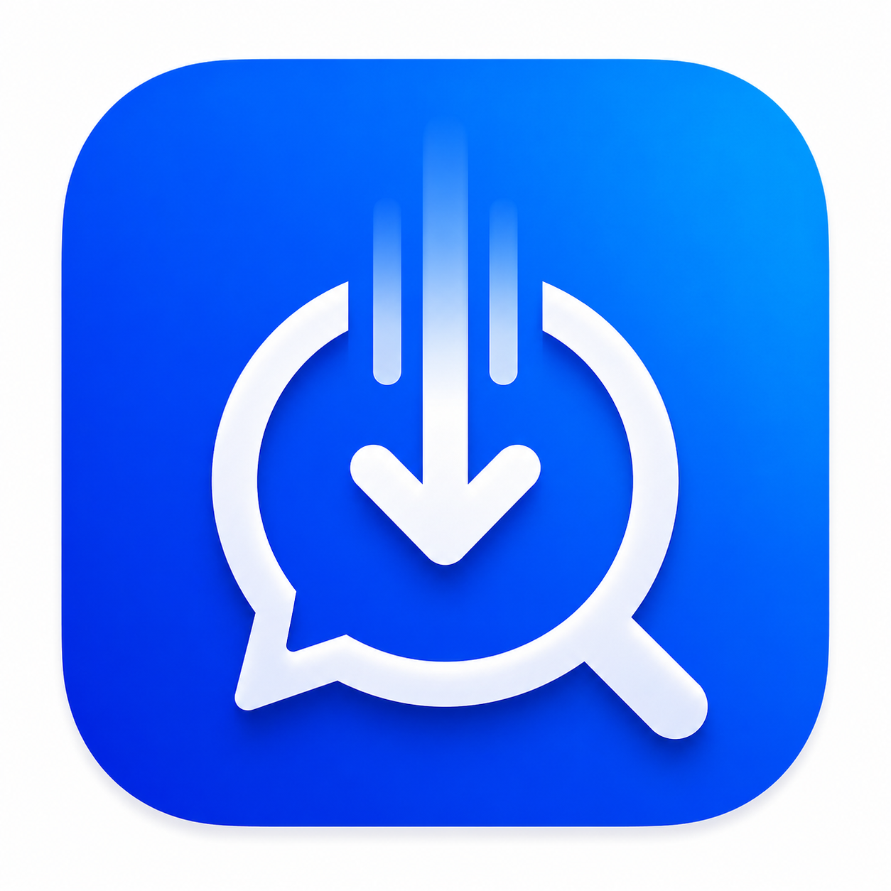

  

<h1 align="center">SwipeAsk</h1>

by SwipeAsk Labs

  <a href="#privacy-policy">Privacy Policy</a> &nbsp;|&nbsp;
  <a href="#terms-of-use">Terms of Use</a>

---

# Privacy Policy

**Effective Date:** June 16, 2025
**Last Updated:** June 16, 2025

SwipeAsk Labs ("we", "us", or "our") built the SwipeAsk app as a free utility tool 
for Android. This page informs you of our policies regarding the collection, use, 
and disclosure of personal information when you use our app.

## 1. Information We Do Not Collect

SwipeAsk does not collect, store, transmit, or share any personal data whatsoever.

Specifically:
- We do not collect your name, email, or any account information
- We do not collect location data
- We do not collect device identifiers
- We do not have a server or backend
- We do not use analytics or tracking tools
- We do not use third-party advertising SDKs

## 2. Screenshots

When you use the AskSnap tile, SwipeAsk captures a screenshot of your screen. 
This screenshot:
- Is saved temporarily in your device's private app storage
- Is sent directly to the AI app you choose using Android's standard share system
- Is never uploaded to our servers (we have none)
- Is never seen or accessed by SwipeAsk Labs
- Is deleted from temp storage after sharing

## 3. Gallery Access

When you use the RecallSnap tile, SwipeAsk reads your photo gallery to build a 
local search index. This data:
- Never leaves your device
- Is stored in a local database on your phone only
- Is never uploaded, shared, or transmitted anywhere
- Can be deleted by uninstalling the app

## 4. Permissions Explained

| Permission | Why We Need It |
|---|---|
| Capture Screen | To take a screenshot when you tap the AskSnap tile |
| Read Photos | To build a local search index for RecallSnap |
| Show Over Other Apps | To display floating overlays for both tiles |
| Post Notifications | Required by Android 13+ for background services |

## 5. Third Party AI Apps

When you share a screenshot to a third-party AI app (ChatGPT, Claude, Gemini, etc.), 
that app's own privacy policy applies to how they handle your data. SwipeAsk has no 
control over and no relationship with those apps.

## 6. Children's Privacy

SwipeAsk does not knowingly collect any information from children under 13. The app 
contains no features directed at children.

## 7. Changes to This Policy

We may update this Privacy Policy from time to time. Changes will be posted on this 
page with an updated date. Continued use of the app after changes means you accept 
the new policy.

## 8. Contact Us

If you have any questions about this Privacy Policy, contact us at:

**Email:** swipeask@kampus-link.com

---

# Terms of Use

**Effective Date:** June 16, 2025
**Last Updated:** June 16, 2025

By downloading or using SwipeAsk, you agree to these Terms of Use. If you do not 
agree, do not use the app.

## 1. What SwipeAsk Does

SwipeAsk is a free Android utility app that provides two Quick Settings tiles:

- **AskSnap** — captures your screen and shares it to an AI app of your choice
- **RecallSnap** — lets you search your photo gallery using natural language

## 2. License

SwipeAsk Labs grants you a personal, non-exclusive, non-transferable, revocable 
license to use this app on your Android device for personal, non-commercial purposes.

## 3. Acceptable Use

You agree not to:
- Use SwipeAsk for any illegal or unauthorized purpose
- Attempt to reverse engineer, modify, or copy the app
- Use the app to capture or share content that violates the rights of others
- Use the app in any way that could damage, disable, or impair it

## 4. No Warranty

SwipeAsk is provided "as is" without warranties of any kind, express or implied. 
We do not guarantee that the app will work perfectly on every device, Android 
version, or with every AI app installed on your phone.

## 5. Limitation of Liability

SwipeAsk Labs shall not be liable for any indirect, incidental, special, or 
consequential damages arising from your use of the app, including but not limited to:
- Loss of data
- Device damage
- Actions taken by third-party AI apps after receiving your screenshot

## 6. Third Party Apps

SwipeAsk works alongside third-party AI apps. We are not affiliated with, endorsed 
by, or responsible for OpenAI, Anthropic, Google, or any other AI provider. Use of 
those apps is governed by their own terms.

## 7. Changes to These Terms

We may update these Terms at any time. Updated terms will be posted here with a new 
date. Continued use of the app constitutes acceptance of the updated terms.

## 8. Governing Law

These Terms are governed by the laws of Algeria. Any disputes shall be resolved 
under Algerian jurisdiction.

## 9. Contact Us

For any questions regarding these Terms, contact us at:

**Email:** swipeask@kampus-link.com

---

  &copy; 2025 SwipeAsk Labs. All rights reserved.

